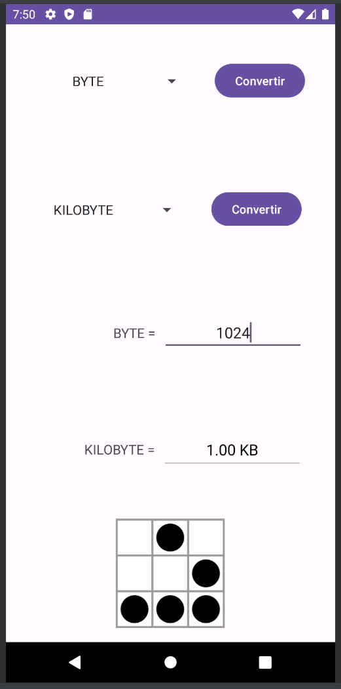
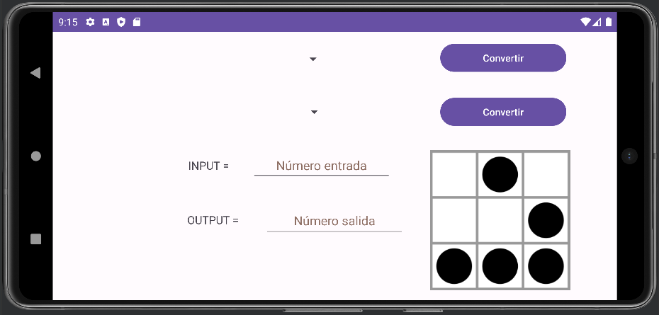

# Android Byte Converter

Este repositorio contiene el código fuente de una aplicación Android desarrollada como parte del ejercicio para la asignatura de Programación multimedia y dispositivos móviles del ciclo de DAM. La aplicación, denominada "Android Byte Converter", permite a los usuarios realizar conversiones entre las diferentes unidades de medida de la escala del byte.

## Funcionalidad

La aplicación proporciona las siguientes funciones:

- **Selección de Unidades:** El usuario puede seleccionar la unidad de medida de origen y la unidad de medida a la cual desea realizar la conversión. Estas opciones se presentan mediante un spinner.

- **Valor a Convertir:** El usuario introduce la cantidad que desea convertir.

- **Botones de Conversión:** Dos botones permiten realizar conversiones en ambas direcciones. Un botón convierte del primer tipo de unidad al segundo, y el segundo botón realiza la conversión en sentido contrario. El resultado se muestra en la pantalla.

- **Formato del Resultado:** El resultado se presenta con dos decimales. Para valores grandes o con muchos decimales, se utiliza el formato científico (x.xxE5 o x.xxE-5).

## Diseño

El diseño de la interfaz de usuario sigue las siguientes directrices:

- **Layout Vertical (por defecto):**
  - La unidad de origen y su botón de conversión ocupan el 20% de la pantalla en vertical.
  - La unidad de destino y su botón de conversión ocupan el 20% de la pantalla en vertical.
  - El valor por convertir ocupa el 20% de la pantalla en vertical.
  - El resultado ocupa el 20% de la pantalla en vertical.
  - El resto de la pantalla está ocupado por una imagen.

- **Layout Horizontal (personalizable):**
  - Se proporciona un segundo archivo XML para el diseño horizontal.
  - El diseño horizontal es libre y puede personalizarse según las preferencias del usuario.

 
{ width="600" style="display: block; margin: 0 auto" }

## Controles

- **Valor por Convertir:** Debe ser numérico sin decimales y no puede contener letras.

- **Unidades de Origen y Destino:** No pueden estar vacías.

## Tabla de Conversión

A modo de ayuda, aquí está la tabla de conversión entre las diferentes unidades de medida de la escala del byte:

| Unidad            | Simbología | Valor en Bytes    |
|-------------------|------------|-------------------|
| Byte              | B          | 1                 |
| Kilobyte (KB)     | KB         | 1024              |
| Megabyte (MB)     | MB         | 1024 KB           |
| Gigabyte (GB)     | GB         | 1024 MB           |
| Terabyte (TB)     | TB         | 1024 GB           |
| Petabyte (PB)     | PB         | 1024 TB           |
| Exabyte (EB)      | EB         | 1024 PB           |
| Zettabyte (ZB)    | ZB         | 1024 EB           |
| Yottabyte (YB)    | YB         | 1024 ZB           |
| Brontobyte (BB)   | BB         | 1024 YB           |
| Geopbyte (GeoB)   | GeoB       | 1024 BB           |

## Autor

- **Nombre del Autor:** Alberto Pérez

## Licencia

Este proyecto está bajo la Licencia [MIT LICENSE](LICENSE). Consulta el archivo LICENSE.md para obtener más detalles.
