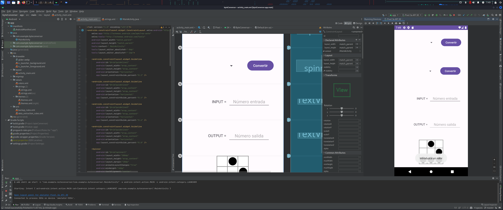
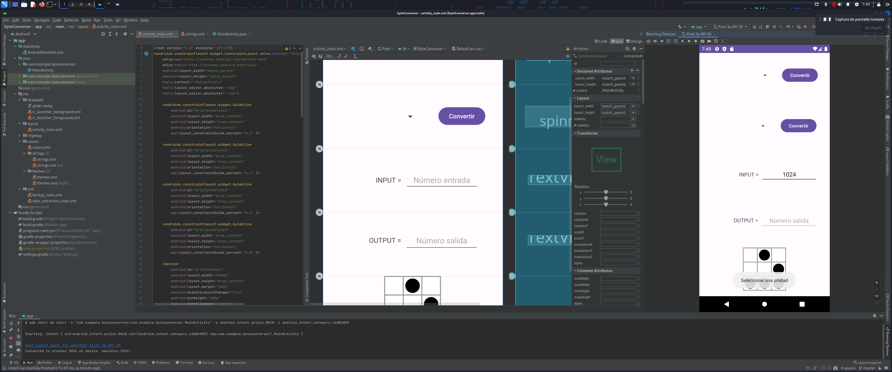
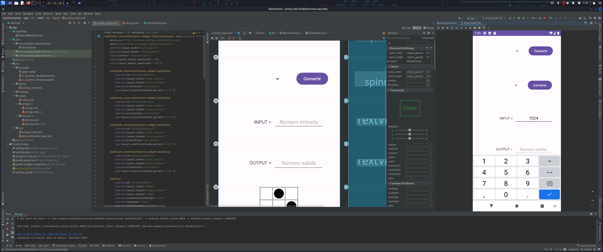
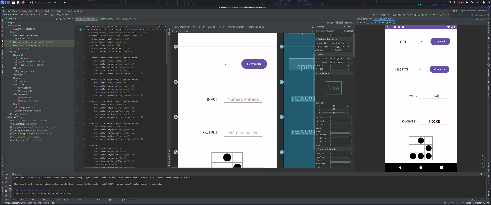
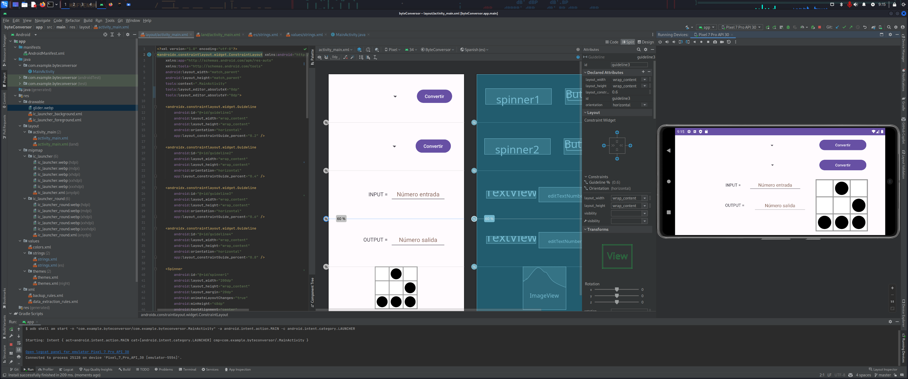

# Documento de Casos de Prueba - Android Byte Conversor

## Introducción

### Propósito del Documento
Este documento tiene como objetivo describir los casos de prueba para la aplicación "Android Byte Conversor". Estos casos aseguran el correcto funcionamiento de las funciones de conversión y la interfaz de usuario según las indicaciones de diseño.

### Alcance
Los casos de prueba cubren las principales funcionalidades de conversión de unidades y garantizan la correcta presentación de resultados.

## Descripción del Sistema

### Resumen del Sistema
La aplicación "Android Byte Conversor" permite a los usuarios realizar conversiones entre diferentes unidades de medida de la escala del byte.

## Casos de Prueba

### Caso de Prueba 1: Selección de Valores en los Spinner y en el campo de Entrada

#### Descripción
Verificar que es necesario seleccionar una unidad de origen y una unidad de destino en los Spinner, además de ingresar un valor numérico en el campo entrada.

#### Pasos de Ejecución
1. Abrir la aplicación.
2. Intentar realizar una conversión sin seleccionar una unidad de origen.
3. Intentar realizar una conversión sin seleccionar una unidad de destino.
4. Intentar realizar una conversión sin ingresar un valor numérico en el campo de entrada.

#### Datos de Entrada
- Unidad de origen: [ninguna]
- Unidad de destino: [ninguna]
- Valor a Convertir: [ninguno]

#### Resultado Esperado
Se muestra un mensaje de error indicando que es necesario seleccionar una unidad de origen y una unidad de destino, además de ingresar un valor numérico en el campo de entrada.

#### Criterios de Éxito
La aplicación valida correctamente la entrada y muestra el mensaje de error.

### Caso de Prueba 2: Validación de Entrada Solo Numérica

#### Descripción
Verificar que solo se permitan valores numéricos en el campo de entrada.

#### Pasos de Ejecución
1. Ingresar un valor alfabético en el campo de entrada.
2. Intentar realizar una conversión.

#### Datos de Entrada
- Valor a Convertir: [un valor alfabético]

#### Resultado Esperado
No permite ingresar el valor alfabético en el campo de entrada.

#### Criterios de Éxito
La aplicación valida correctamente la entrada y no permite ingresar el valor alfabético.

### Caso de Prueba 3: Conversión de Byte a Kilobyte

#### Descripción
Verificar que la conversión de Byte a Kilobyte se realiza correctamente.

#### Pasos de Ejecución
1. Seleccionar "Byte" como unidad de origen.
2. Seleccionar "Kilobyte" como unidad de destino.
3. Ingresar un valor numérico en el campo de entrada.
4. Hacer clic en el botón de conversión.

#### Datos de Entrada
- Unidad de origen: Byte
- Unidad de destino: Kilobyte
- Valor a Convertir: 1024

#### Resultado Esperado
El resultado de la conversión se presenta correctamente en la pantalla. El resultado se muestra con 2 decimales y hace uso de notación científica si es necesario.

#### Criterios de Éxito
El valor convertido es el correcto según la tabla de conversión.

### Caso de Prueba 4: Conversión de Kilobyte a Byte

#### Descripción
Probar la conversión de Kilobyte a Byte.

#### Pasos de Ejecución
1. Seleccionar "Kilobyte" como unidad de origen.
2. Seleccionar "Byte" como unidad de destino.
3. Ingresar un valor numérico en el campo de entrada.
4. Hacer clic en el botón de conversión.

#### Datos de Entrada
- Unidad de origen: Kilobyte
- Unidad de destino: Byte
- Valor a Convertir: 1024

#### Resultado Esperado
El resultado de la conversión se presenta correctamente en la pantalla. El resultado se muestra con 2 decimales y hace uso de notación científica si es necesario.

#### Criterios de Éxito
El valor convertido es el correcto según la tabla de conversión.

### Caso de Prueba 5: Conversión Inversa de Geopbyte a Byte

#### Descripción
Verificar que la conversión inversa de Gigabyte a Megabyte se realiza correctamente.

#### Pasos de Ejecución
1. Seleccionar "Geopbyte" como unidad de origen.
2. Seleccionar "Byte" como unidad de destino.
3. Ingresar un valor numérico en el campo de entrada.
4. Hacer clic en el botón de conversión.

#### Datos de Entrada
- Unidad de origen: Geopbyte
- Unidad de destino: Byte
- Valor a Convertir: 1

#### Resultado Esperado
El resultado de la conversión inversa se presenta correctamente en la pantalla.

#### Criterios de Éxito
El valor convertido es el correcto según la tabla de conversión. El resultado se muestra con 2 decimales y hace uso de notación científica si es necesario.

### Caso de Prueba 6: Landscape layout

#### Descripción
Verificar que la interfaz de usuario se muestra correctamente en modo horizontal.

#### Pasos de Ejecución
1. Rotar el dispositivo a modo horizontal.
2. Verificar que la interfaz de usuario se muestra correctamente.

#### Datos de Entrada
- [ninguno]

#### Resultado Esperado
La interfaz de usuario se muestra correctamente en modo horizontal, aunque se observa un problema de diseño en vista horizontal alternativa, dejando el textView y editText de salida desalineados respecto a los de entrada.

#### Criterios de Éxito
La interfaz de usuario se muestra correctamente en modo horizontal.

## Matriz de Cobertura de Pruebas

### Funcionalidades/Casos de Prueba

| Funcionalidad               | Caso de Prueba 1 | Caso de Prueba 2 | Caso de Prueba 3 | Caso de Prueba 4 | Caso de Prueba 5 | Caso de Prueba 6         |
|-----------------------------|------------------|------------------|------------------|------------------|------------------|--------------------------|
| Conversión de Unidades      | Correcto         | Correcto         | Correcto         | Correcto         | Correcto         | Correcto                 |
| Interfaz de Usuario         | Correcto         | Correcto         | Correcto         | Correcto         | Correcto         | Problema encontrado      |

## Observaciones y Problemas Encontrados

Se encuentra un problema de diseño en vista horizontal alternativa, dejando el textView y editText de salida desalineados respecto a los de entrada.

## Aprobación

### Revisado por
Alberto Pérez del Río
